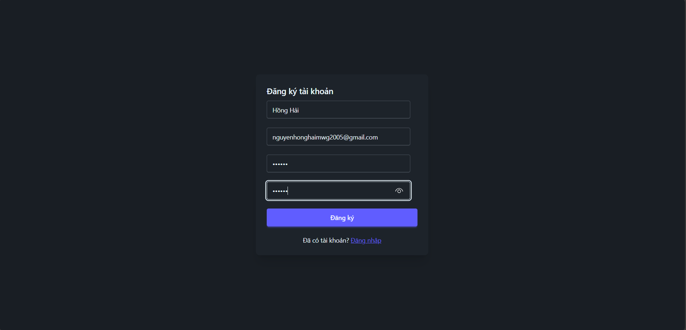
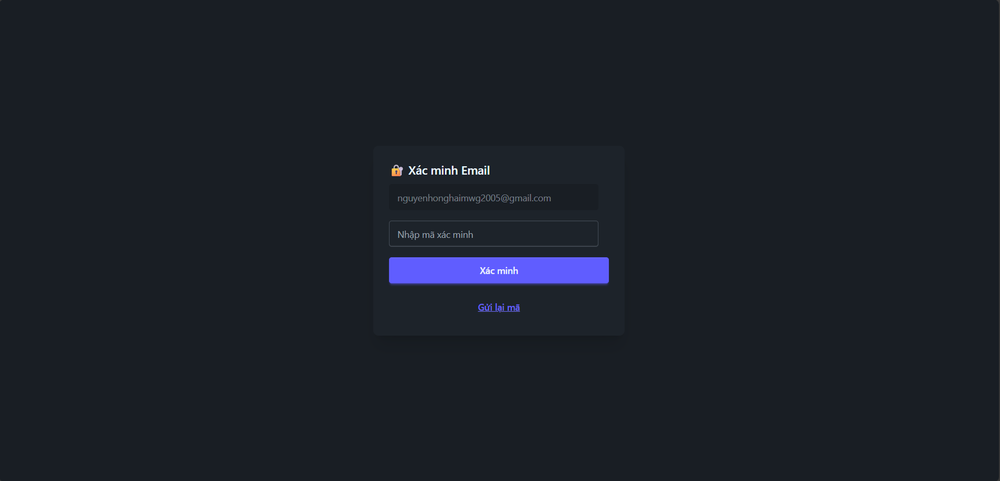
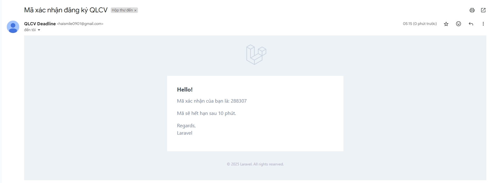
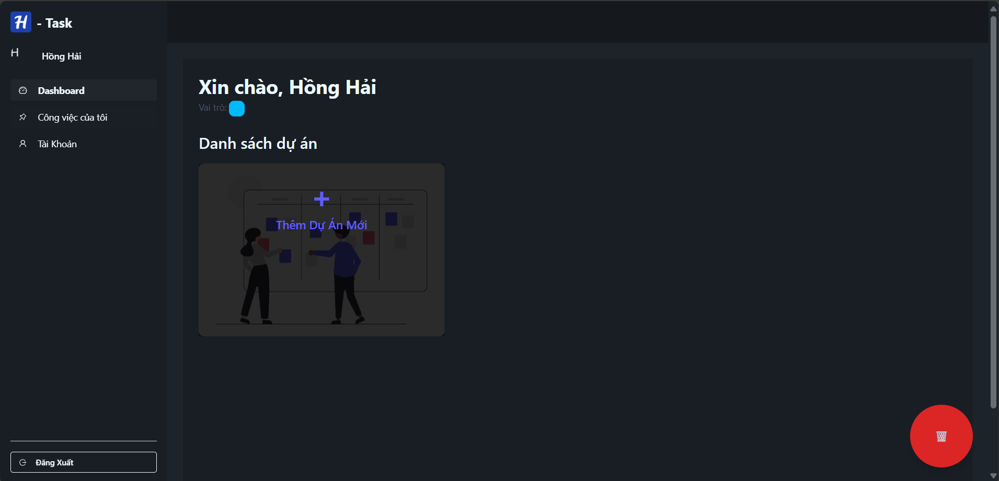
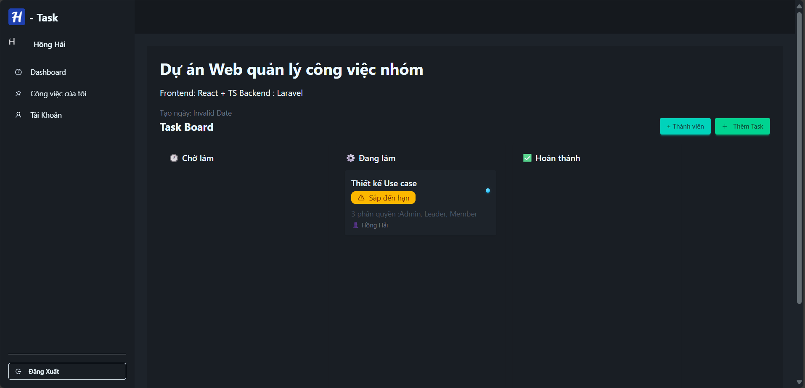
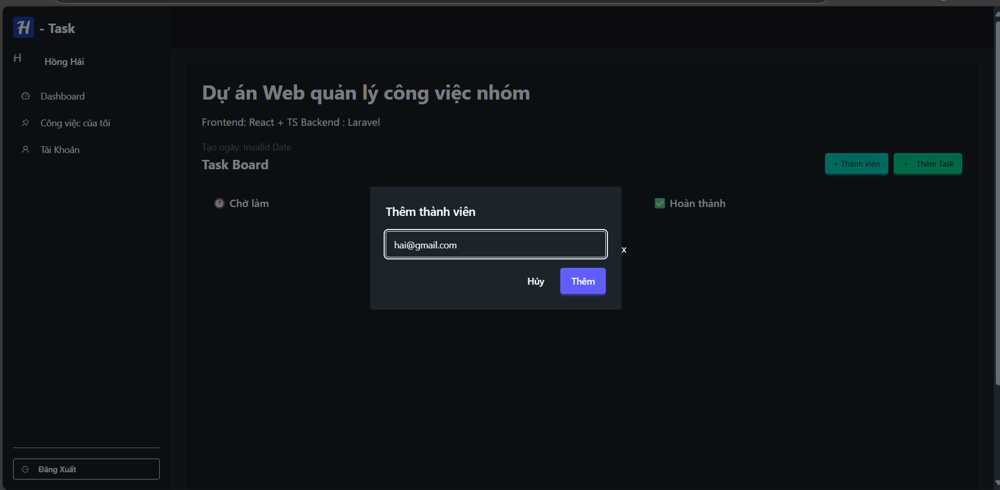
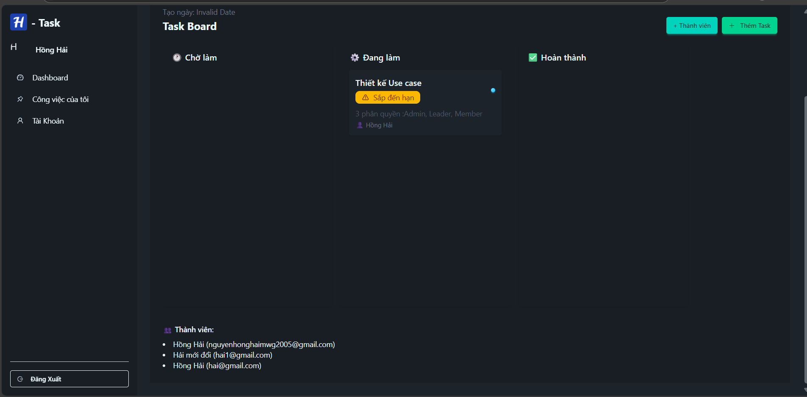
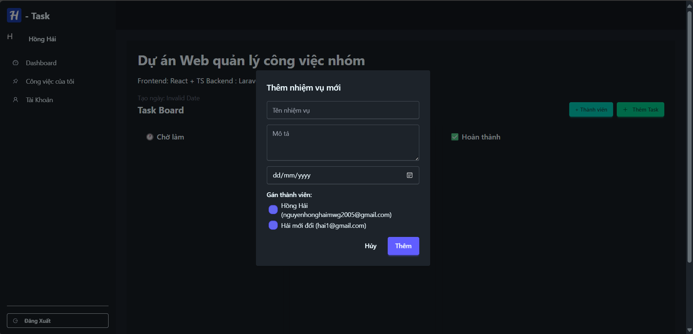
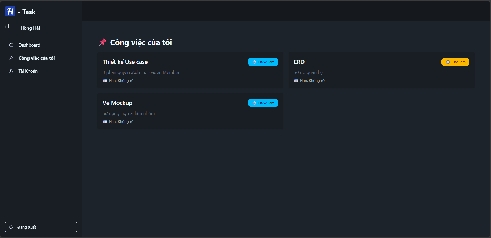

# Web_H-task

# H-Task - Ứng dụng quản lý công việc nhóm

H-Task là một ứng dụng web hỗ trợ quản lý dự án theo mô hình Kanban, được xây dựng bằng **ReactJS** (frontend), **Laravel** (backend) và **MySQL** (cơ sở dữ liệu). Dự án được triển khai qua nhiều Sprint theo phương pháp **Agile – Scrum** và đã hoàn thiện các chức năng cốt lõi cần thiết để vận hành trong môi trường thực tế.

## 🔧 Công nghệ sử dụng

- **Frontend**: ReactJS, Tailwind CSS, Axios, React Router
- **Backend**: Laravel 10, Sanctum (xác thực), Laravel Mail
- **Database**: MySQL
- **Khác**: RESTful API, Git, Postman (test API)

## ✅ Tính năng chính

- [x] Đăng ký, đăng nhập và xác minh người dùng qua email
- [x] Quản lý dự án theo bảng Kanban
- [x] Phân quyền người dùng: Admin, Leader, Member
- [x] Giao việc, chỉnh sửa, theo dõi tiến độ từng nhiệm vụ
- [x] Giao diện trực quan, dễ sử dụng, tương thích nhiều thiết bị
- [x] Hệ thống API RESTful tách biệt frontend và backend
- [x] Test liên tục sau mỗi vòng phát triển (Sprint)
## 🖼️ Giao diện dự án

### Trang đăng ký


### Trang xác minh email


### Code được gửi qua email


### Trang chính



###Chi tiết dự án


### Bảng Kanban – Drag & Drop


### Modal - Thêm thành viên



### Quản lý thành viên và nhiệm vụ



### Công việc của tôi



## ⚙️ Cài đặt & chạy thử

### Backend (Laravel)
<pre> 
```bash
cd backend
composer install
cp .env.example .env
php artisan key:generate
php artisan migrate
php artisan serve
</pre>


### Frontend (React)

<pre> 
  ```bash
cd frontend
npm install
npm run dev
 </pre>


 ---

## 🖼️ Giao diện dự án


⚠️ Lưu ý: Cần cấu hình .env ở cả backend và frontend để kết nối API chính xác.

🚧 Tình trạng triển khai
Hiện tại, do giới hạn thời gian, dự án chưa được triển khai chính thức lên hosting, tuy nhiên toàn bộ chức năng đã sẵn sàng để đưa lên môi trường production.

👨‍💻 Nhóm phát triển
Dự án được thực hiện bởi nhóm sinh viên CNTT, với mục tiêu rèn luyện kỹ năng làm việc nhóm, phát triển sản phẩm theo quy trình chuyên nghiệp (Agile – Scrum) và làm quen với các công nghệ hiện đại trong thực tế.

📄 Giấy phép
Dự án phục vụ mục đích học tập, nghiên cứu. Không sử dụng vào mục đích thương mại nếu chưa có sự đồng ý từ nhóm phát triển.
